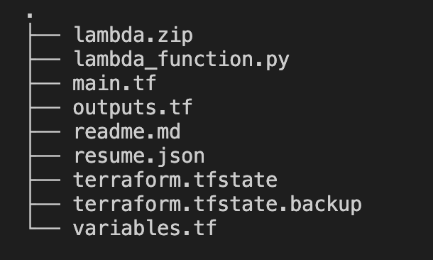

### Cloud Resume API Challenge 

Welcome to the Cloud Resume API Challenge. A project where I had the opportunity to build and deploy a serverless API using AWS Cloud provider using Terraform as an Infrastructure as Code tool, integrated with GitHub Actions for CI/CD. 

#### The primary goal? 
<b><i>Construct an API that can serve resume data in JSON format.</i></b>

#### Challenge Objective 🎯

The task is to create a Serverless function that fetches resume data stored in a NoSQL Database and return it in JSON format. To level up the challenge, integrate GitHub Actions to automatically deploy updates to your Cloud Serverless function whenever you push to your repository. 

#### Key Requirements

<b>NoSQL Database: </b><i>Containing sample resume data.</i>
<b > Serverless Function:</b> <i>Fetch and return resume data.</i>
<b> GitHub Actions:</b> <i>Automatically package and deploy your serverless on every push to the repository.<i>

#### Getting Started 🚀

 Here I used terraform to  deploy the lambda function, dynamoDB table and API Gateway to trigger the lambda function.  The resume.json file was passed to the dynamoDB table.

File Structure 

Make sure AWS cloud credentials are set, the variables, resume.json file are kept ready.
The lambda function uses python 3.9 to retrieve the data from the DynamoDB table. The lambda function is compressed and sent as a zip file.

